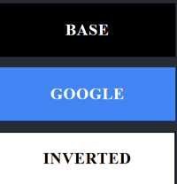
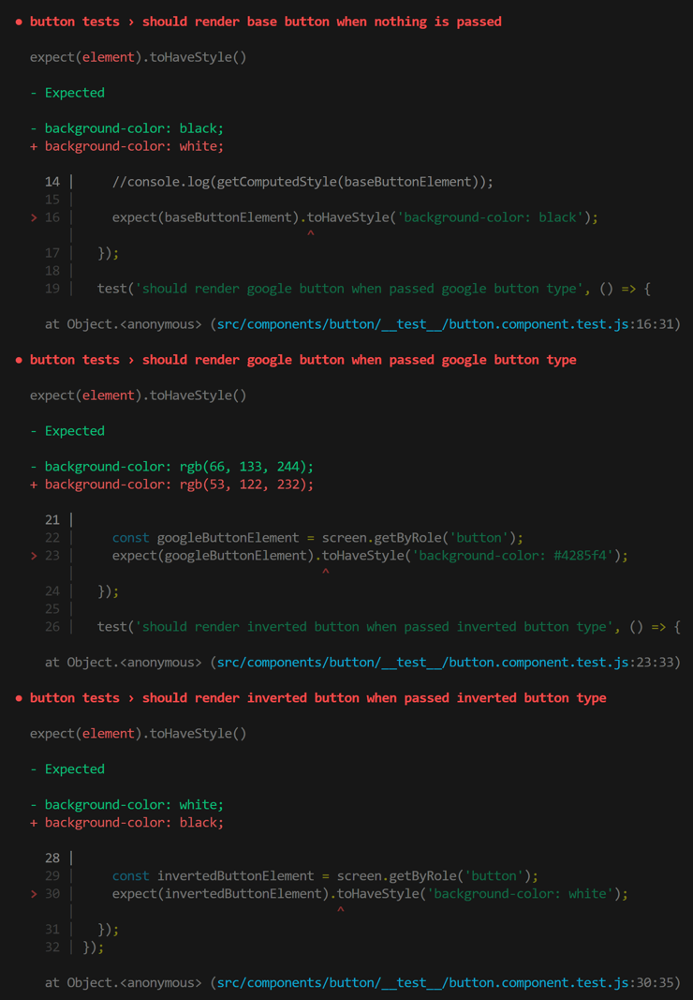

# Button Tests

### `Description`

---

I have a button that's a styled component. The button has a buttonType property that's used to render button types "base, google and inverted".

I'm testing the button component using the React Test Library (RTL) and Jest. I'm running tests from the command line via "npm test".

I'm using the background-color property in the tests to determine if the correct button is rendered e.g. expect(baseButtonElement).toHaveStyle('background-color: black');

Note: all button types render correctly in the UI.

### `Issues`

---

1. the first issue I've encountered is that the computed style for the the button has the background color from the hover selector (&:hover) from the BaseButton style component. The google and inverted button types are derived from the BaseButton type (see: src\components\button\button.styles.tsx). This issue is causing all three of the button tests to fail.

2. the second issue I've encountered is that I'm unable to generate a code coverage report from the command line via "npm test -- --coverage".

### `Components`

---

| `Component`                                      | `Path`                                                     |
| ------------------------------------------------ | ---------------------------------------------------------- |
| Button Component       | src\components\button\button.component.tsx                 |
| Button Style Component | src\components\button\button.styles.tsx                    |
| Button Tests           | src\components\button\_\_test\_\_\button.component.test.js |

### `Tests`

---

| `Test`                                                         |              `Status`              |
| -------------------------------------------------------------- | :--------------------------------: |
| should render base button when nothing is passed               | fails |
| should render google button when passed google button type     | fails |
| should render inverted button when passed inverted button type | fails |

### `Test Results`

---

